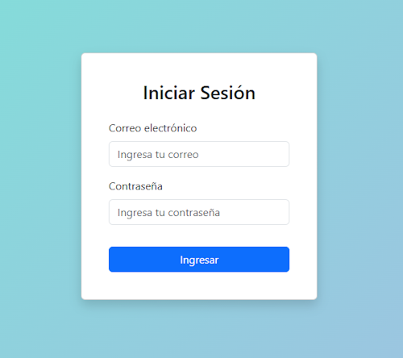
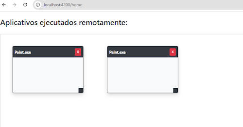
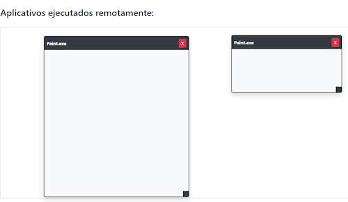
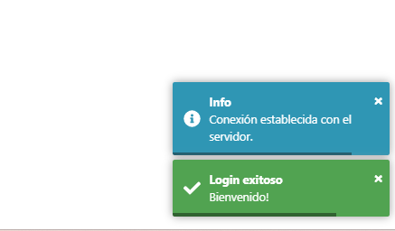

# Challenge .NET Developer - Notepad Controller

## Descripción
Este proyecto es un desafío técnico que simula el control remoto de ventanas de aplicaciones (Notepad.exe o MSPaint.exe) desde una aplicación web en Angular, utilizando un backend en .NET 8 con comunicación en tiempo real vía SignalR.

Permite iniciar, mover, redimensionar y cerrar instancias de aplicaciones en el servidor desde la web, respetando restricciones como evitar superposiciones.

---

## Tecnologías Utilizadas
- **Backend:** ASP.NET Core 8, Entity Framework Core 8, SignalR
- **Frontend:** Angular 18, Bootstrap 5, ngx-toastr
- **Base de Datos:** SQL Server Express
- **Autenticación:** JWT Bearer Tokens
- **Node.js:** 18.19.1
- **NPM:** 10.2.4

---

## Requisitos Previos
- Node.js >= 18.19
- Angular CLI >= 18
- .NET SDK 8.0
- SQL Server Express instalado localmente

---

## Instrucciones de Ejecución

### Backend (.NET 8)
1. Abrir `NotepadControllerApp` en Visual Studio 2022 o superior.
2. Configurar la cadena de conexión en `appsettings.json`.
3. Aplicar las migraciones:
dotnet ef database update
4. Ejecutar la aplicación:

dotnet run

El backend estará escuchando en `https://localhost:7158`

### Frontend (Angular 18)
1. Navegar a la carpeta del frontend:
cd notepad-controller-client
2. Instalar dependencias:

npm install

3. Ejecutar la aplicación:

ng serve

La web estará disponible en `http://localhost:4200`

---

👤 Gestión de Usuarios
Puedes registrarte directamente utilizando el formulario de login (/register vía API utilizando swagger).

No existen usuarios precargados.

Se implementó un ABM completo de usuarios desde la API.
---

## Funcionalidades

- [x] Registro y Login de usuario (JWT).
- [x] Gestión de usuarios (alta, modificación, baja).
- [x] Control de instancias de MS Paint en servidor Windows.
- [x] Movimiento de ventanas en el frontend y sincronización en el backend.
- [x] Redimensionamiento de ventanas.
- [x] Cierre de ventanas.
- [x] Prevención de superposiciones.
- [x] Persistencia de estado de ventanas en la base de datos.
- [x] Recuperación automática de instancias si los procesos caen (esta es una mejora propuesta adicional).
- [x] Manejo global de errores en frontend y backend.
- [x] Logout de usuario.
- [x] Manejo de sesiones expirada.
- [x] Estructura moderna usando Angular 18 y .NET 8.

---

## Decisiones Tomadas
- Originalmente el desafío sugería usar Notepad.exe para controlar remotamente las instancias.
- Durante el desarrollo, se detectó que Notepad.exe en Windows 10/11 es una aplicación UWP (Universal Windows Platform), dificultando su manejo mediante procesos tradicionales.
- Para mantener el foco en los objetivos principales (comunicación en tiempo real, control remoto de ventanas, persistencia), se optó por utilizar MSPaint.exe, una aplicación Win32 clásica.
- De esta forma, se pudo implementar correctamente el control de procesos y ventanas utilizando APIs de Win32, como requería explícitamente el enunciado.
- Las operaciones de mover, redimensionar y cerrar se realizaron utilizando la función MoveWindow de Win32 vía P/Invoke en C#, utilizando APIs nativas de Windows (funciones de la user32.dll)
- Esta decisión garantizó el cumplimiento de los requerimientos, manteniendo una experiencia fluida para el usuario 

---

## Bonus Implementados

- Manejo de reconexión automática en SignalR.
- Toasts amigables de notificación.
- UI responsive con Bootstrap 5.
- Validaciones de inputs.
- Seguridad básica en endpoints (Authorize).

---

## Notas Adicionales

- En caso de cerrar todas las ventanas abiertas, el usuario deberá cerrar sesión y volver a ingresar para generar nuevas instancias.
- Se utilizaron técnicas modernas de Angular y prácticas recomendadas de .NET para el diseño del backend.
- El control de superposición se gestiona en el frontend para ofrecer una UX fluida.

---

## Screenshots (Opcional)
## Screenshots

### Login

### Aplicativos abiertos

### Movimiento de Ventanas y redimensionamiento

### Mensajes toasts

---

## Autor

Desarrollado por Sergio Sisniega Prado 👨‍💻

---